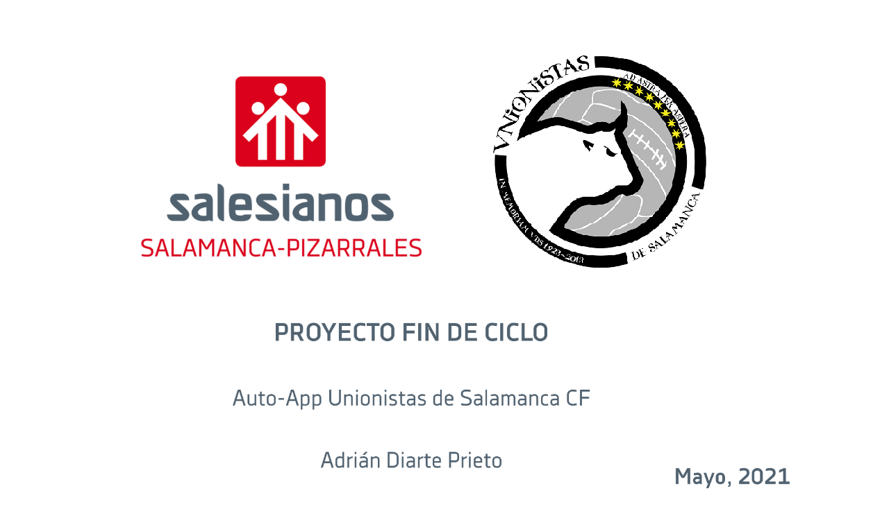

# Proyecto de Fin de Ciclo - Desarrollo de Aplicaciones Multiplataforma

Proyecto de Fin de Ciclo del alumno Adrián Diarte Prieto con tutor Ángel Varillas García y presentado el 28 de Mayo de 2021 en el colegio Salesianos San José obteniendo una calificación de 10.

    

## Acerca de

Aplicación sobre el club Unionistas de Salamanca CF con ingesta de información automatica de diversas fuentes. Disponible desde Android 8.0 en adelante.

## Autor ✒️

* **Adrián Diarte** - [adriandpdev](https://github.com/adriandpdev)

## License 📄

Copyright © 2021 Adrian Diarte Prieto

